## 1. Project Title

**SilentVoice – A Safety-First Disguised Support Application**

---


## 2. Description / Overview

SilentVoice is a mobile safety application designed to help individuals facing domestic abuse or unsafe situations seek help discreetly. The app is intentionally disguised as a calculator to avoid suspicion, while providing powerful hidden features such as anonymous chat with verified helpers, an emergency SOS system, nearby help map, and a secure Evidence Vault.

The core philosophy of SilentVoice is privacy, discretion, and reliability. All sensitive actions are hidden behind secure flows, encryption, and minimal user interaction, ensuring safety even under surveillance or low-connectivity conditions.

---

## 3. Features

### 🔢 Disguised Calculator Interface

- **Fully functional calculator** with standard arithmetic operations
- Acts as the app’s primary entry point and realistic disguise
- Unlocks hidden dashboards via PIN-based authentication
- Supports separate roles: **User** and **Helper**
- On first launch, users can enable App Lock using the **three-dot menu (⋮) on the top-left**, which safely guides them through the initial secure setup

<p align="center">
  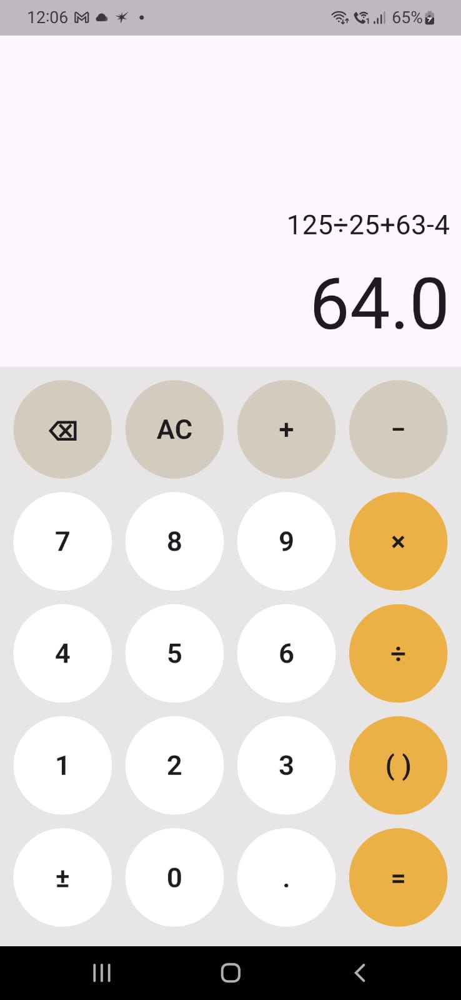
</p>

<p align="center">
  <i>Fully functional calculator interface used as a disguise. All safety features remain hidden during normal calculator usage.</i>
</p>


### 🕶️ Hidden Safety Features (Disguised & Context-Aware)

- All safety features remain **completely hidden** during normal calculator use
- No sensitive UI is visible unless App Lock is enabled
- Hidden dashboards unlock only after correct PIN entry
- App automatically returns to calculator mode when backgrounded
- **Quick Exit** is available across all sensitive screens

<p align="center">
  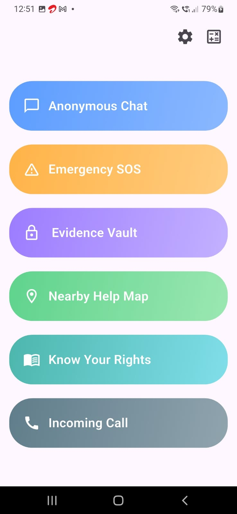
</p>

<p align="center">
  <i>Hidden safety dashboard that appears only after correct PIN entry, ensuring discretion and privacy.</i>
</p>

### 🔐 App Lock & Security

- PIN-based access for users and helpers
- Secure PIN hashing with salts
- Automatic app locking on background or interruption

<p align="center">
  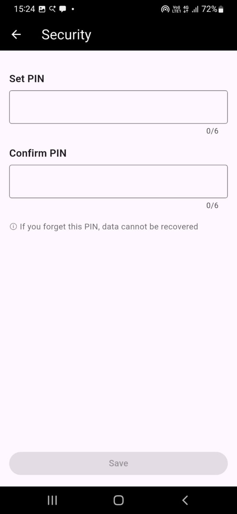
</p>

<p align="center">
  <i>Secure PIN setup used to protect all sensitive features. If forgotten, data cannot be recovered.</i>
</p>

<p align="center">
  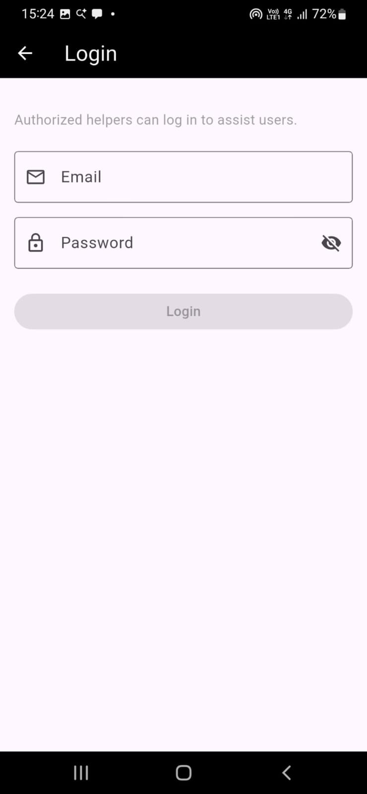
</p>

<p align="center">
  <i>Authorized helpers can securely log in to assist users through anonymous chat.</i>
</p>

### 💬 Anonymous Chat System

- Real-time anonymous chat between users and helpers
- Helper availability and request queue system
- End-to-end encrypted messages

<p align="center">
  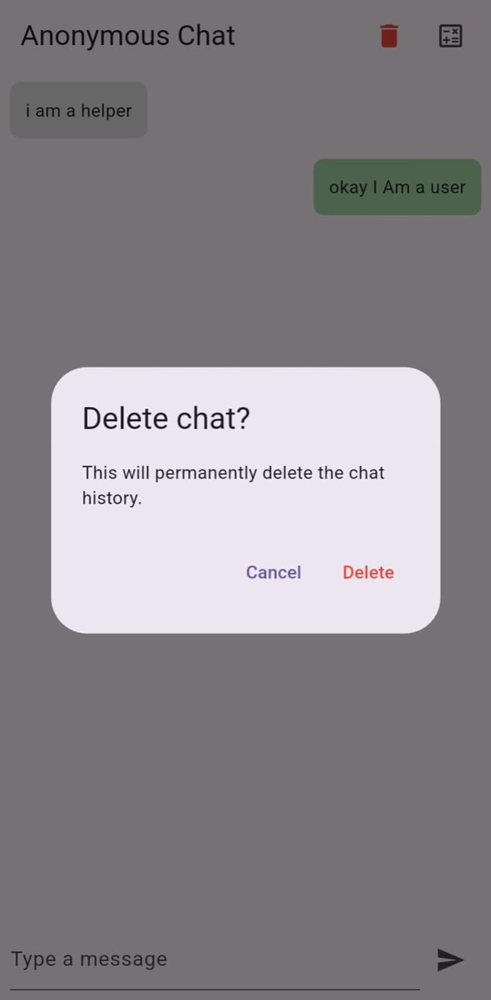
</p>

<p align="center">
  <i>End-to-end encrypted anonymous chat system connecting users with verified helpers.</i>
</p>

### 🚨 Emergency SOS

- One-tap SOS trigger with haptic feedback
- Sends SMS alerts to trusted contacts
- Includes live Google Maps location link
- Works without internet connectivity
- Guided permission and setup handling

<p align="center">
  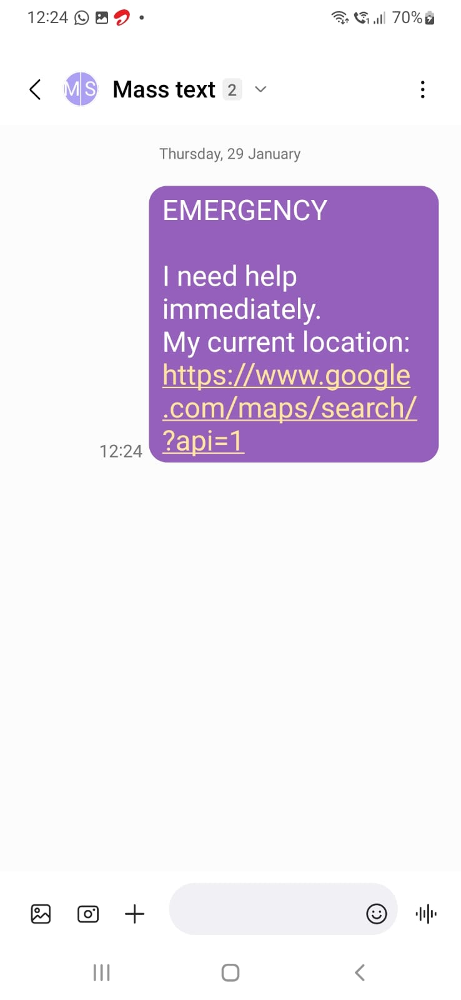
</p>

<p align="center">
  <i>One-tap SOS sends an emergency SMS with live Google Maps location to trusted contacts.</i>
</p>

<p align="center">
  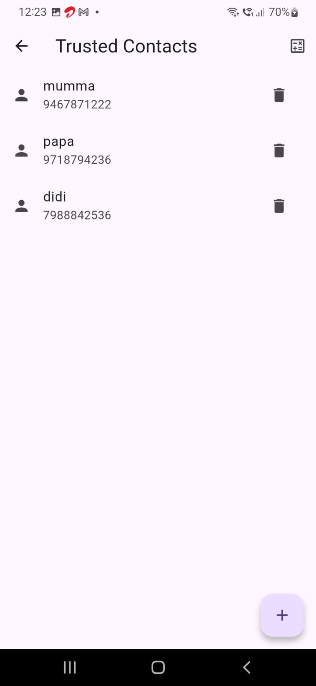
</p>

<p align="center">
  <i>Users can add up to five trusted contacts who will receive emergency alerts.</i>
</p>

<p align="center">
  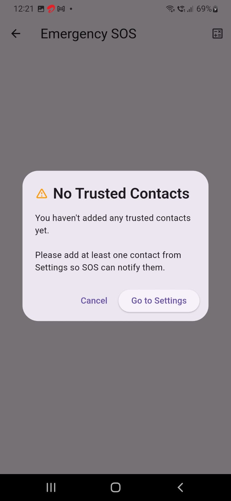
</p>

<p align="center">
  <i>Clear guidance shown when trusted contacts are missing or permissions are denied.</i>
</p>

### 🗂️ Evidence Vault

- Secure storage for images, audio, and videos
- Local AES encryption before upload
- Cloud stores **only encrypted files**
- On-device decryption for viewing
- Automatic cleanup of decrypted temporary files

<p align="center">
  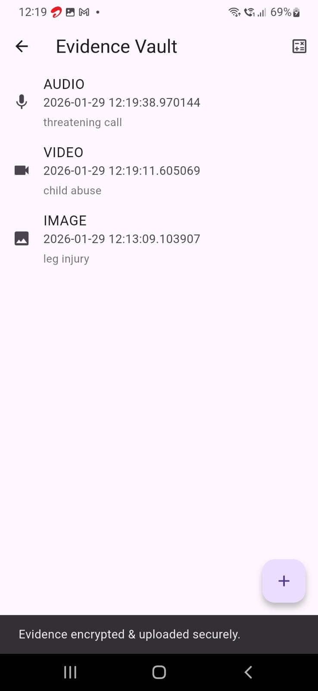
</p>

<p align="center">
  <i>Encrypted evidence vault for securely storing images, audio, and videos.</i>
</p>

### 📍 Nearby Help Map

- Displays nearby **police stations and hospitals**
- Map-based navigation for quick access to help
- Supports immediate physical assistance discovery

<p align="center">
  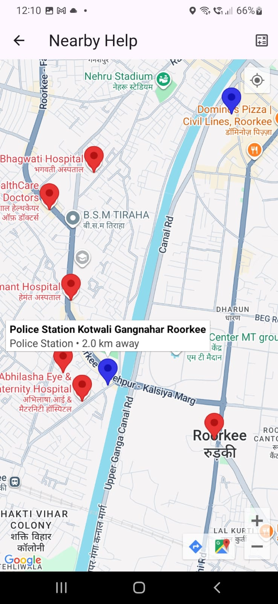
</p>

<p align="center">
  <i>Displays nearby police stations and hospitals using Google Maps for quick assistance.</i>
</p>

<p align="center">
  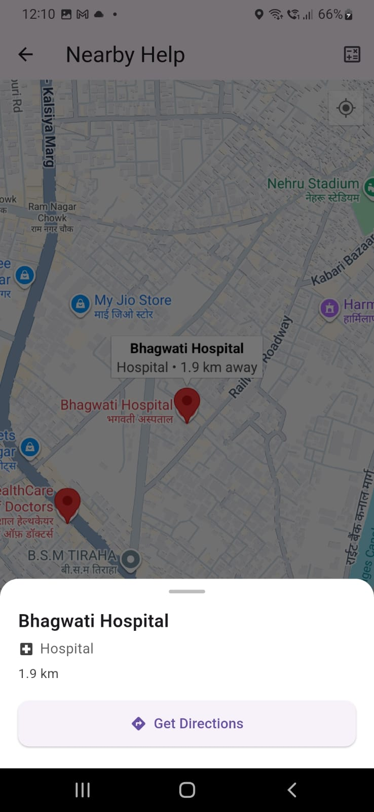
</p>

<p align="center">
  <i>Nearby Help Map showing hospitals and police stations around the user’s current location, with quick access to directions.</i>
</p>

### 📞 Fake Incoming Call

- Simulates a realistic incoming phone call
- User-configurable caller name
- Custom delay before the call rings
- Designed to help users safely exit unsafe situations

<p align="center">
  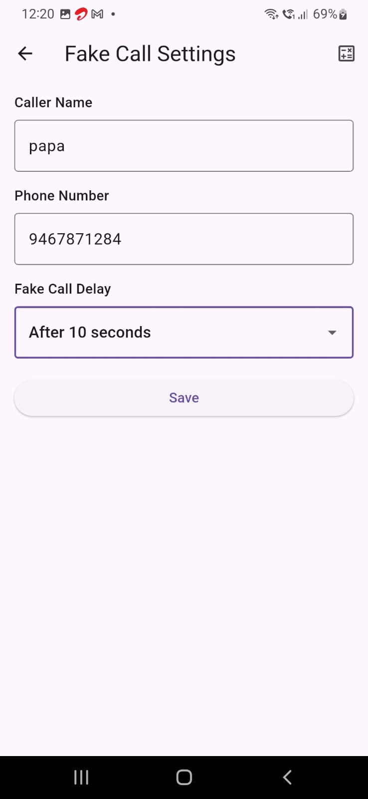
</p>

<p align="center">
  <i>Fake call configuration screen where users can customize caller details and delay to trigger a realistic incoming call.</i>
</p>

---

## 4. Tech Stack

### Frontend
- Flutter (Dart)

### Backend & Services
- Firebase Authentication (Anonymous for users + Email and password for helpers)
- Cloud Firestore (chat & metadata)
- Firebase Storage (encrypted evidence files)

### Security & Utilities
- AES Encryption
- PBKDF2 Key Derivation
- SharedPreferences (local secure storage)
- Geolocator (location services)
- URL Launcher (SMS handling)

---

## 5. Installation

### Prerequisites
- Flutter SDK installed
- Android Studio / VS Code
- Firebase project setup

### Steps
### Clone repository
git clone https://github.com/MDGSpace-SOC-D-2025/SilentVoice.git

### Navigate to project directory
cd silentvoice

### Install dependencies
flutter pub get

### Run the app
flutter run

---

## 6. Usage

1. Launch the app, it opens as a **fully functional calculator**.
2. Open the **three-dot menu (⋮) on the top-left** on first use.
3. Enable **App Lock** and choose a role:
   - **User** (person seeking help)
   - **Helper** (authorized support person)
4. Set a secure PIN.
5. Use the calculator normally, no suspicious UI is visible.
6. Enter the correct PIN through the calculator to unlock hidden features.

### User Capabilities
- Start anonymous chat with helpers
- Trigger Emergency SOS
- Store encrypted evidence (images, audio, video)
- View nearby police stations and hospitals
- Trigger fake incoming calls to exit unsafe situations

### Helper Capabilities
- Log in using email/password
- Accept anonymous chat requests
- Assist users in real time

---

## 7. Configuration / Environment Variables

SilentVoice uses **Firebase** for backend services.

Configuration is handled via:
- `firebase_options.dart` (auto-generated using FlutterFire CLI)

Required Firebase services:
- Firebase Authentication
- Cloud Firestore
- Firebase Storage

No manual environment variables are required.
Google Maps API keys are configured at the platform level and restricted by application identifiers as per Google’s recommended practices.

---

## 8. Project Structure

```text
lib/
├── anonymous_chat/         # Anonymous user-helper chat system
├── auth/                   # Authentication logic
├── emergency_sos/          # SOS & trusted contacts
├── evidence_vault/         # Encrypted evidence storage
├── fake_call/              # Fake incoming call feature
├── nearby_help_map/        # Police & hospital locator
├── navigation/             # App navigation handling
├── screens/                # Core UI screens
├── security/               # Encryption, hashing, lifecycle lock
├── widgets/                # Reusable UI components
├── firebase_options.dart   # Firebase configuration
└── main.dart               # Application entry point
```
---

## 9. Roadmap

Planned future improvements:
- Biometric authentication (fingerprint / face unlock)
- Multi-language support
- Verified helper badges (NGOs, counselors, volunteers).
- Text-to-voice+ voice-to-text for users who can’t type safely.
- AI-based threat detection

---

## 10. Known Issues

- Emergency SOS functionality depends on SMS availability and the device’s default messaging app.
- Location sharing accuracy depends on GPS availability and user-granted permissions.
- Network-dependent features such as anonymous chat require a stable internet connection.
- App behavior when running in the background may vary slightly across different Android devices.

---

## ⚠️ Disclaimer

SilentVoice is a **support tool**, not a complete replacement for emergency services.  
In immediate danger, users should contact local emergency authorities.

### Built with empathy, privacy, and safety at its core.
